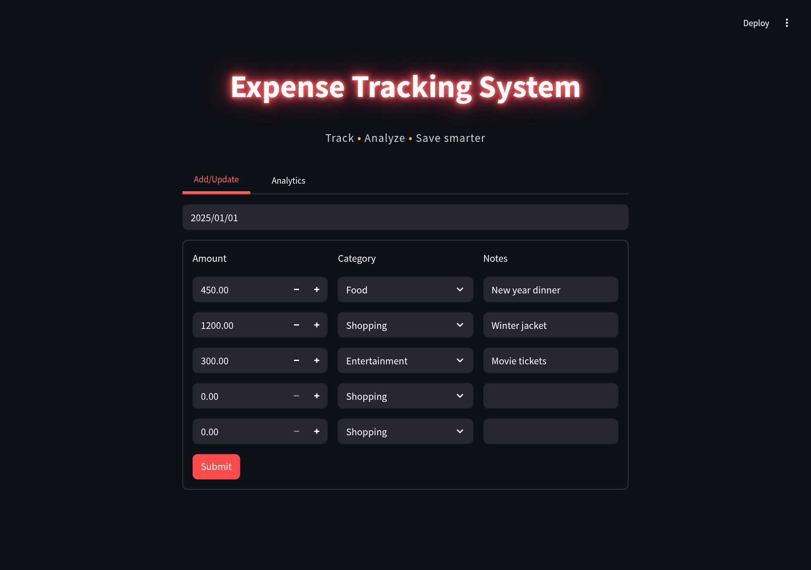
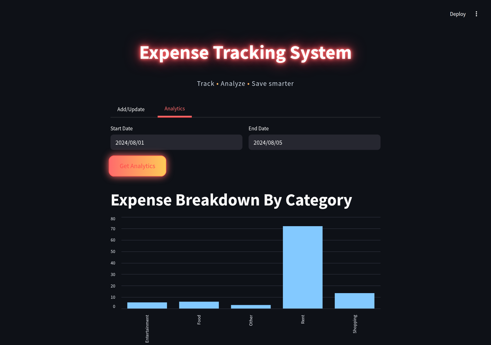

# Expense Tracking System

A small app I built to log my daily expenses and see where the money goes, category by category.





## Why I built it

I wanted a quick way to note down what I spend each day without keeping a spreadsheet, and then check which categories take most of my money over a week or a month.

## Features

- Add or edit up to 5 expenses for any date (amount, category, notes)
- Categories: Rent, Food, Shopping, Entertainment, Other
- Analytics for a date range: total per category and its share in %, as a bar chart and a table

## Tech stack

- **Frontend:** Streamlit 1.45, pandas 2.2
- **Backend:** FastAPI 0.115, Pydantic 2, Uvicorn
- **Database:** PostgreSQL on Neon (psycopg2)
- **Tests:** pytest
- Python 3.12
- Hosted on Streamlit Community Cloud (frontend) and Render (backend)

## How it works

The Streamlit app never touches the database. It sends requests to the FastAPI backend, the backend runs the SQL on Neon, and sends the result back as JSON.

```text
Streamlit  --HTTP-->  FastAPI  --SQL-->  Postgres (Neon)
```

## Run it locally

You'll need Python 3.12 and a free Postgres database on [Neon](https://neon.tech). Run `backend/schema.sql` once in Neon's SQL editor to create the tables.

```bash
git clone https://github.com/saxenamayank-20/Expense_Tracking_System.git
cd Expense_Tracking_System

python -m venv .venv
source .venv/bin/activate        # windows: .venv\Scripts\activate
pip install -r requirements.txt

cp .env.example .env
```

Fill in `.env`:

- `DATABASE_URL` - your Neon connection string
- `API_URL` - backend url for the frontend, `http://localhost:8000` when running locally

Start the backend:

```bash
uvicorn backend.server:app --reload
```

Start the frontend in another terminal:

```bash
streamlit run frontend/app.py
```

## API routes

| Method | Route | What it does |
| --- | --- | --- |
| GET | `/` | health check |
| GET | `/expenses/{date}` | expenses for a date |
| POST | `/expenses/{date}` | replace the expenses for a date |
| POST | `/analytics/` | category totals and % for a date range |
| POST | `/login` | check username and password |

## Project structure

```text
backend/        fastapi app, db queries, schema.sql
frontend/       streamlit app (app.py + one file per tab)
testing/        pytest tests
screenshots/
requirements.txt
```

## Running tests

```bash
python -m pytest testing/
```

The tests use the database in `DATABASE_URL` and expect the sample row that `schema.sql` adds.

## What I learned

- The first deploy broke because the backend was pointing to MySQL on localhost, which doesn't exist on a server. Moving to a hosted Postgres on Neon fixed it.
- Keeping the db credentials in env vars instead of the code made it easy to run the same code locally and on Render.
- Splitting the app into a FastAPI backend and a Streamlit frontend meant deploying and connecting two services.

## Known limitations

- The backend is on Render's free plan, so it sleeps when idle. The first load after a while can take up to a minute.
- It's a single shared expense list, there are no user accounts yet. The `/login` route exists but the app doesn't use it.
- Max 5 expenses per day in the form.
